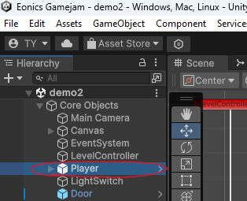
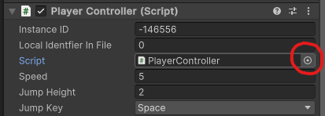
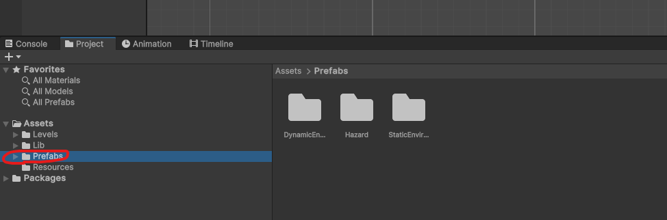

# Getting started
1) Inside the Levels folder, copy the folder "Template" and rename it to "FirstnameLastname" (your name)
2) Inside *your* new folder, open PlayerController.cs and update line 4 to use a new namespace:
   ```cs
   namespace Levels.Template >> namespace Levels.FirstnameLastname
   ```
3) Open DoorController.cs and do the same:
   ```cs
   namespace Levels.Template >> namespace Levels.FirstnameLastname
   ```
4) Change the name of the scene file "template.unity" to "firstname_lastname.unity"
5) Open your scene by double clicking on the scene file
6) In the scene hierarchy (top-left), open the "Core Objects" and select the "Player" object.  
  
In the inspector (top-right), press the 3 dots and select "debug" view.  
  
In the same inspector, press the circle next to the PlayerController script and select the PlayerController script that resides in your folder.  
You can also drag and drop your script into this box.  

7) Repeat step 6 for the DoorController
8) Put your object inspector back into normal mode (from debug)
9) Press the play button and check that everything runs correctly!
10) In the scene hierarchy, under the core objects you will find the LevelController.
    Click on this and look at the object inspector. There are three fields for you to fill in there.
    1) Your own name
    2) The Name of the level
    3) A description of the level where you can explain anything, like a special mechanic that you implemented.

# Building a level
## Constraints
You can make your level any way you want, but you must adhere to the following constraints:
* Everything fits in one screen, so you don't change the size or position of the camera
* The level contains a door, so that we can load in the next level
* The level contains at least one trigger to open the door (By default, this is the light switch and it is mandatory)
* You must be able to beat your own level
* Any code you write resides within your own folder
* Don't change any code from the Lib folder (but you may extend and adjust as you wish).

## Beginner
If the first thing that comes to mind when you hear C# is a piano, don't worry, you will be able to create your own level
without coding! Let's take a look at the project structure first:  
  
* The Levels directory contains any user created level, including yours. You can open different scene files by double clicking to see what the levels look like.
* The Lib directory is the no-go zone for now. This contains scripts to make sure everything works like it should.
* **The Prefabs directory contains objects you can put in your scene. You can use these to create your level by dragging and dropping them.**
* The Resources folder contains objects that are always loaded at run time, nothing to see or do there.

## Intermediate
Besides just using the available prefabs that I prepared, you can do a bit more if you know some basic coding. If you open your own
PlayerController script, you will notice that it is pretty much empty:  
```csharp
 public class PlayerController : AbstractPlayerController
    {
        protected override void Awake()
        {
            base.Awake();
        }

        protected override void Move()
        {
            base.Move();
        }

        protected override bool CanJump()
        {
            return base.CanJump();
        }
        ...
    }
```
It overrides all the methods of the AbstractPlayerController and simply calls the base function. You may implement these methods any way you want.
As an example, you can refer to the PlayerController in the Demo2 level, where I altered the code to give the player a double jump. If you lack inspiration,
but want to try your hand at this, here are some ideas that you could explore:
* Give the player a Triple jump
* Change the jump height depending on how long the button was pressed
* Enable the player to jump/fly like flappy bird
* Introduce fall damage
* Give the player more HP (i.e. make it so he does not die in one hit)
* Reverse the controls
* Make the movement speed ramp up over time

## Expert
If you know how to use Unity or are eager to learn, I invite you to create your own assets! Use the code in the Lib folder and try to make variations, or create
your own stuff from scratch. If you have a fun idea and are not sure how to go about it, I'll be available to help!

# What to do when you are done?
If you are happy with your level, you can prepare your submission. Remember to update your level details inside the level controller (author name, level name & level description).  

Now you can create a new branch, to keep things organized use your own name again, i.e. 
```bash
git checkout -b firstname_lastname
```
Next, commit and push your code:
```bash
git add .
git commit -m "Commit message"
git push origin firstname_lastname
```
Finally, you have to make a pull request from your form to the main branch of my repository. If you don't know how to do this, use [this link](https://docs.github.com/en/pull-requests/collaborating-with-pull-requests/proposing-changes-to-your-work-with-pull-requests/creating-a-pull-request-from-a-fork) to guide you.
You're done! If your level compiles and works correctly, I will add it to the final version of the game :)
